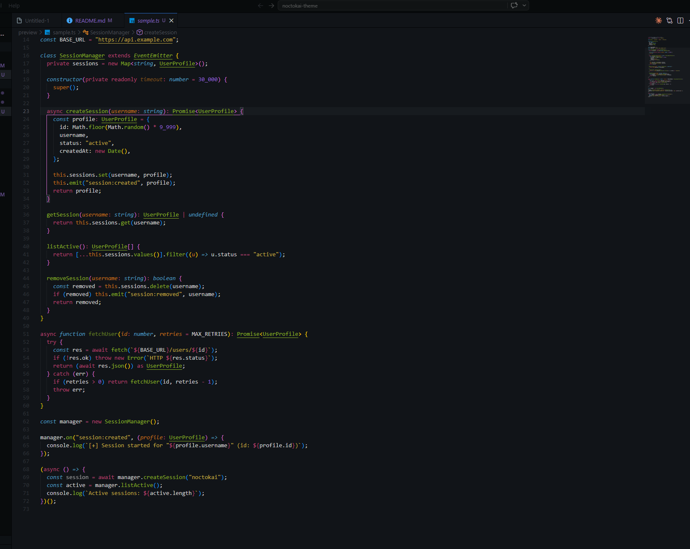
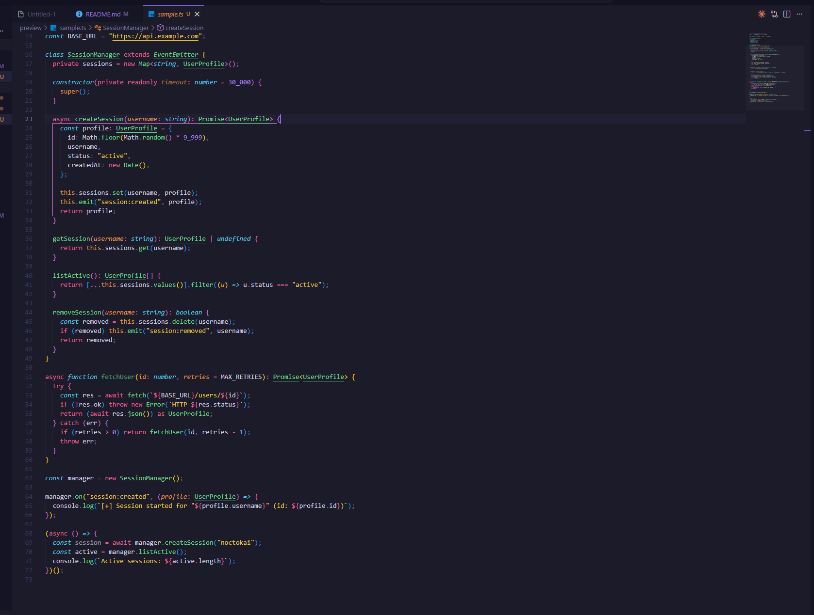
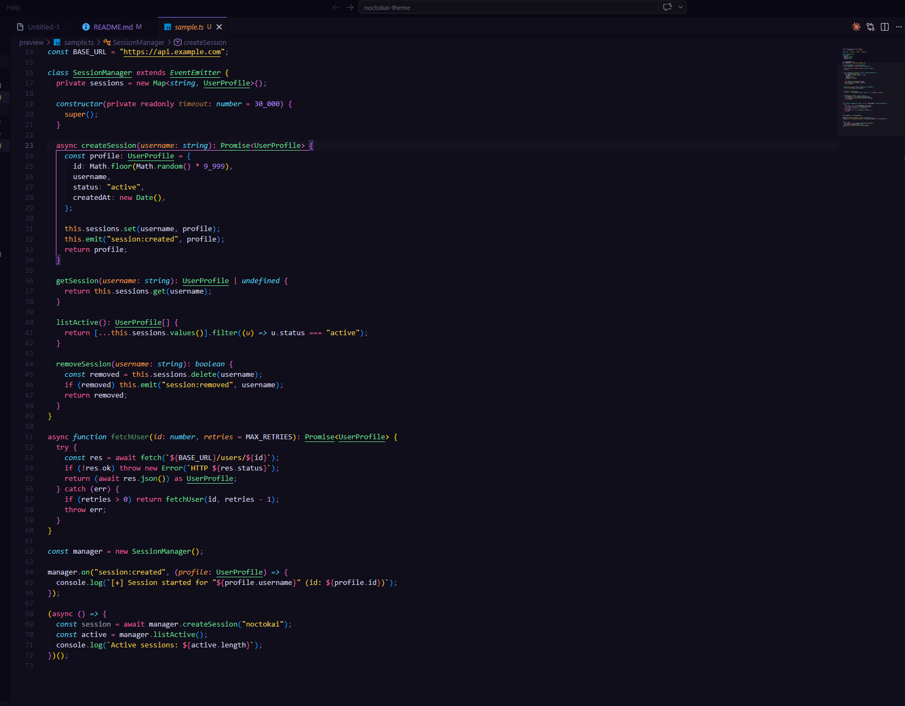

# Noctokai

A low-brightness dark theme blending **Monokai Night** and **Dracula** color palettes — designed for long coding sessions with reduced eye strain.

## Screenshots

## Variants

| Variant | Description |
| --- | --- |
| **Noctokai** | Dark blue-grey UI with muted Monokai syntax colors |
| **Noctokai Purple** | Deep purple UI with vibrant Monokai-inspired syntax |
| **Noctokai Darkest Purple** | Near-black purple UI — the darkest variant |

## Features

- Ultra-dark backgrounds (`#111418` / `#1C1B29` / `#0F0E1A` depending on variant)
- Monokai-inspired syntax palette (pink keywords, green functions, gold strings)
- Dracula accent colors (purple constants, teal types)
- Subtle git decorations in muted purple

## Installation

1. Open **Extensions** in VS Code (`Ctrl+Shift+X`)
2. Search for `Noctokai`
3. Click **Install**
4. Open **Command Palette** (`Ctrl+Shift+P`) → `Preferences: Color Theme` → select your preferred variant

## Color Reference

### Default

| Element | Color |
| --- | --- |
| Background | `#111418` |
| Keywords | `#B84070` |
| Functions / Classes | `#88B025` |
| Strings | `#C0A840` |
| Constants / Numbers | `#9060D0` |
| Types / Support | `#4E9EC0` |
| Comments | `#505870` |
| Modified/Untracked files | `#8868C0` |

### Noctokai Purple / Noctokai Darkest Purple

| Element | Color |
| --- | --- |
| Background | `#1C1B29` / `#0F0E1A` |
| Keywords | `#E8609A` |
| Functions / Classes | `#6DD890` |
| Strings | `#E8C850` |
| Constants / Numbers | `#B088F0` |
| Types / Support | `#58C8E8` |
| Comments | `#585580` |
| Modified/Untracked files | `#8B6CF6` |
